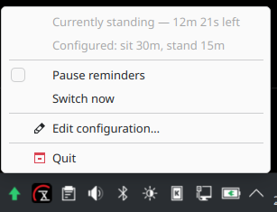
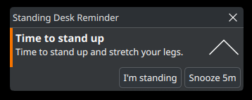

# standing-desk-reminder

A small, modern Rust utility that reminds you to alternate between **standing**
and **sitting** at your desk. It shows desktop notifications on a configurable
cadence, with an optional system tray icon and an optional `systemd --user`
service for background use.

Inspired by [Shogan/remember-to-stand](https://github.com/Shogan/remember-to-stand),
rewritten for modern Rust and tested on Ubuntu with both **GNOME** and **KDE**.

## Screenshots




## Highlights

- **Pure Rust, no system `-dev` packages.** Notifications and the tray both use
  [`zbus`](https://crates.io/crates/zbus) (D-Bus) — there is no GTK, no
  `libdbus`, and no ALSA to install. Just `cargo build`.
- **Works on GNOME and KDE.** Notifications use the freedesktop
  `org.freedesktop.Notifications` service. The tray uses the
  [StatusNotifierItem](https://www.freedesktop.org/wiki/Specifications/StatusNotifierItem/)
  spec via [`ksni`](https://crates.io/crates/ksni).
- **Graceful tray fallback.** If no tray host is available the app logs a
  warning and keeps running headless — reminders still fire.
- **Interactive tray.** The icon is drawn in code (a green up-arrow while
  standing, a blue down-arrow while sitting, grey when paused). Its menu shows
  the current phase with a live countdown and the configured durations, plus:
  - **Left-click** (or double-click): pause / resume
  - **Middle-click**: switch phase now
  - Menu items: *Pause reminders*, *Switch now*, *Edit configuration…*,
    *Reload configuration*, *Quit*
- **Live config reload.** Edits to the config file are picked up automatically
  (the file is polled every few seconds) and the tray's "Configured" line
  updates so you can confirm the change took effect — no restart needed. An
  invalid edit is rejected with a notification and the previous settings are
  kept.
- **Persistent reminders you won't miss.** Each reminder stays on screen until
  you act on it (so it's there when you return to your desk) and carries two
  buttons: **"I'm standing/sitting"** restarts the countdown from now, and
  **"Snooze"** postpones the switch.
- **Pause while the screen is locked.** The countdown freezes when you lock the
  screen and resumes on unlock, via systemd-logind's `LockedHint` (works on
  GNOME and KDE; disable with `pause_when_locked = false`).
- **Friendly config** in TOML with human-readable durations (`45m`, `1h 30m`).

## Install

```sh
cargo install --path .
# the binary lands in ~/.cargo/bin/standing-desk-reminder
```

No extra packages are required to build — only a Rust toolchain.

### A note on the tray on GNOME

GNOME Shell does **not** implement the system tray / StatusNotifierItem
natively. To see the tray icon on GNOME, install the
*AppIndicator and KStatusNotifierItem Support* extension:

```sh
sudo apt install gnome-shell-extension-appindicator
# then enable it in the Extensions app and log out/in
```

KDE Plasma supports the tray out of the box. On either desktop, if the tray is
unavailable the reminders still work — pass `--no-tray` to skip it entirely.

## Usage

```sh
# Run in the foreground (Ctrl-C to stop). Uses your config file.
standing-desk-reminder

# Override intervals for a session without editing the config:
standing-desk-reminder run --sit 45m --stand 15m

# Headless / no sound:
standing-desk-reminder run --no-tray --no-sound

# Where is the config file?
standing-desk-reminder config-path
```

The first run writes a commented default config to
`~/.config/standing-desk-reminder/config.toml`.

## Configuration

```toml
# Durations accept friendly units, e.g. "30s", "15m", "1h 30m".

sit_duration     = "45m"   # how long to sit before the stand reminder
stand_duration   = "15m"   # how long to stand before the sit reminder
stand_message    = "Time to stand up and stretch your legs."
sit_message      = "Time to sit down for a bit."
snooze_duration  = "5m"    # how long the "Snooze" button postpones a reminder
sound            = true    # ask the desktop to play its notification sound
pause_when_locked = true   # freeze the countdown while the screen is locked
start_phase      = "sitting"  # "sitting" or "standing"
```

CLI flags (`--sit`, `--stand`, `--no-sound`) override the file for that run.

## Run in the background (systemd user service)

```sh
# Write the unit, then enable + start it (auto-starts on login):
standing-desk-reminder install-service

# Inspect / follow logs:
systemctl --user status standing-desk-reminder.service
journalctl --user -u standing-desk-reminder.service -f

# Stop and remove it:
standing-desk-reminder uninstall-service
```

`install-service` writes a unit to `~/.config/systemd/user/` pointing at the
current binary. Use `--no-enable` to write the unit without starting it. A
template is also provided in [`dist/`](dist/standing-desk-reminder.service) for
manual or packaged installs.

## Development

```sh
cargo build
cargo test
cargo clippy --all-targets
```

## License

MIT — see [LICENSE](LICENSE).
